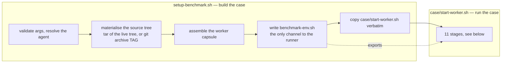
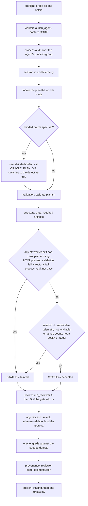
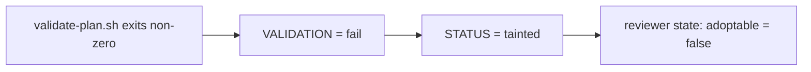

# Benchmark harness — architecture (flows)

**Audience: maintainers of the harness.** `README.md` covers how to run a
benchmark and `runtime/README.md` covers the agent-driver contract. This file
records the shape of a case: the stage order, what taints a run, and what a plan
must contain before the harness will accept it.

Drawn per `CODE-STYLE.md` §11: node text names a script or an artifact, decision
diamonds carry the real condition, and reasoning lives in the prose.

---

## 1. The two halves of a case

`setup-benchmark.sh` runs once to build a case, then hands off. Everything after
the handoff is the generated runner, and the only channel between them is
`benchmark-env.sh`.

`case/start-worker.sh` is a real file, copied unchanged into the case. It used to
be a 1271-line quoted heredoc inside `setup-benchmark.sh`, which is why nothing
could lint or test it. A test asserts the copy is byte-identical, so edit the
file, not the copy.

---

## 2. Stage order and what taints a run

A tainted run still completes and still publishes. Taint is a verdict about
whether the evidence is usable, not an error.

Two things surprise people:

**The exit code is the worker's, not the verdict.** The runner ends with
`exit "$CODE"`, so a fully tainted run whose worker exited cleanly exits 0. The
verdict lives in `telemetry.json`'s taint fields — read those, not `$?`.

**Taint is sticky and it propagates.** A tainted run is not adoptable, which is
what the reviewer-state synthesis records. That chain is the reason a plan
fixture has to be a *valid* plan:

---

## 3. What a plan must contain

The structural gate (`lib-structural-gate.sh`) is a required-artifact check, run
against whatever plan the worker produced. Deriving this list from the source
costs half an hour, so it is written down here.

Required, by name:

- `plan-description.md`
- `progress.md`
- `validation.md` or `validation-results.md`
- `analysis-report.md` or `analysis.md`

Required, by pattern anywhere under the plan:

- `goal.md`
- `*work-unit*` or `*atomic-work-unit*`
- `*ui*user*stor*` or `*ui*stor*`
- `*adversarial*review*`
- `*bug*` or `*bugs*`
- `*-testing.md` or `*testing*.md`

Required as a directory holding at least one file, when the run is configured to
expect it:

- `ui-story-runs/`
- `context/snapshots/`

Satisfying this list is **necessary but not sufficient** for an accepted run:
`validate-plan.sh` runs separately, and its failure taints the run through the
chain above. `tests/fixtures/review-lifecycle-plan/` is a committed plan that
passes both, which is why the lifecycle test uses it instead of a transient
`.plans/` tree.

---

## 4. Known risks recorded elsewhere

`runtime/README.md` holds the driver contract and its "Known risk" section — the
analyzer has no timeout yet gates the batch exit code, and the
`REVIEWER_COMMAND` seam can spend real tokens under a non-codex driver.
`planning/ARCHITECTURE.md` §6 holds the planning-side contradictions. This file
does not duplicate either.
