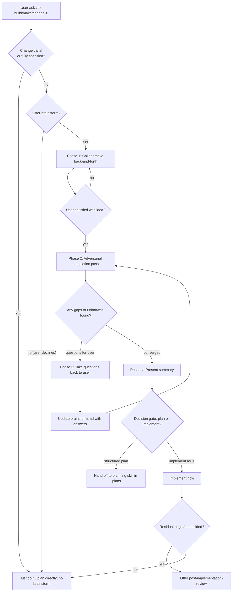

<!-- MODE: PROD -->

# Brainstorm

Use this skill to **shape an under-specified idea into a complete, agreed
picture before anyone commits to a plan or an implementation.** It is the
deliberate "think first" step between a raw request and the planning skill.

The output is a single living document,
`.plans/<initiative>/brainstorm.md`, written during a real back-and-forth with
the user. That document is the source of truth for everything that follows.

Do not use it for a small, self-contained change, and do not use it when the
user already knows exactly what they want and asks for a plan or implementation
directly.

## When to enter (and when to skip)

Offer the brainstorm gate any time the user says something like *"make X"*,
*"build X"*, *"I want X"*, *"improve X"*, or *"let's add X"* **and** the request
is under-specified or could branch in materially different directions.

Ask once, plainly:

> "This could branch in a few directions. Do you want to brainstorm it first
> (a short back-and-forth to pin down what we're building), or go straight to
> a plan / implementation?"

Skip the offer (do not ask) when:
- The change is small, mechanical, or already fully specified.
- The user explicitly said "just do it", "no need to discuss", or asked for a
  plan/implementation directly.
- You are mid-implementation and the task is already locked.

If the user declines the brainstorm, proceed to whatever they asked for
(plan via the planning skill, or implement directly) and record the decision.

## Decision tree



## Phase 1 — Collaborative back-and-forth

Work one idea at a time in a loop with the user. You drive the structure; the
user supplies the intent.

1. **Anchor the objective.** Ask what problem the user is trying to solve and
   what "done" looks like. Write it down immediately.
2. **Explore, don't design yet.** Surface the main dimensions of the idea:
   scope, users/audience, constraints, tradeoffs, effort, and risk. For each,
   ask a focused question and let the user decide. Do not silently pick for
   them on anything that materially changes scope.
3. **Record continuously.** After each exchange, update
   `.plans/<initiative>/brainstorm.md` with what was decided, what is still
   open, and what was ruled out (non-goals).
4. **Name the initiative.** Derive a short slug (e.g. `benchmark-agent-runtime`)
   and put the document at `.plans/<initiative>/brainstorm.md` so a later plan
   can live beside it ("where everything is").
5. **Stop repeatedly asking.** Once a point is settled, stop re-asking it.
   Batch related open questions rather than interrupting the user one at a
   time.

## Phase 2 — Adversarial completion pass (fresh agent)

When the user is satisfied with the captured idea, run a **lighter-than-planning**
completeness pass to find what the collaboration missed. Its job is completeness,
not critique of a final design.

- **Always run this in a separate agent with a fresh start and fresh view.**
  Never "play adversary" yourself in your own context — your context already
  holds the decisions and will defend them. Spawn a fresh subagent, feed it the
  current `brainstorm.md`, and ask it: *what else should we look at? which edge
  cases? what could we be forgetting? what is still undecided?*
- The fresh subagent must be **skill-locked** exactly as it is spawned. It must
  not load any other skill on its own; the only skill it may use is the one
  named in its starting prompt. Include in that prompt verbatim: "Do not load
  any skill on your own. Use only the skills explicitly named in this starting
  prompt; do not infer a skill from file names, directories, or paths (for
  example `.plans/`, `.brainstorm/`, or skill files). If you believe another
  skill is needed, state it and stop — do not load it." It must also be
  **bounded-read locked**: if it reads any plan/context artifact, it must use
  the planning skill's gated reader `plan-context.sh` (bounded views,
  `--max-bytes`, `--max-records`) and never load a whole plan file, plan
  directory, or the `.plans/` tree wholesale.
- The fresh subagent assumes the **eve persona (sharp contrarian)**: spawn it
  with `ROLE_ID=eve` and have it load its scoped role docs and voice via
  `ROLE_ID=eve bash <PLANNING_SKILL_DIR>/scripts/role-context.sh eve`. It
  attacks where the plan is actually weak, states each objection on its
  merits, and drops it once answered; it reports its persona id in its
  returned findings. A spawn that cannot resolve ROLE_ID=eve fails closed and
  must be respawned.
- Keep the pass shallower than the planning skill's adversarial review: you are
  completing an idea, not validating a work breakdown.
- Each finding the fresh agent returns is one of:
  - a **gap** (something the idea should cover) → add it to the document;
  - a **question for the user** → add it to the open-questions list;
  - **out of scope / rejected** → record the reason and move on.
- The fresh agent must not edit the document itself; it returns findings, and
  you (the brainstorming agent) fold them in. Loop the pass until it stops
  producing new, material items (convergence).

## Phase 3 — Question resolution (batched, user-chosen)

Any unknown raised in Phase 2 that would affect scope, approach, or risk must
go back to the user before the idea can be called complete.

- Use your **question tool** (the agent question/asking capability) to ask the
  user, in **batches of at most 5 questions at a time**, resolved one batch
  after another.
- Each individual question must offer **multiple-choice options plus a
  free-type "type your own answer" option** — never a bare open-ended prompt
  and never only fixed choices.
- Only decision-relevant open questions go into a batch. Close each answer by
  recording it in `.plans/<initiative>/brainstorm.md` (and marking that
  question resolved) before starting the next batch.
- If an answer raises a new question, add it to the open-questions list and
  include it in the next batch; otherwise return to the adversarial pass.
- Never silently guess an answer to a scope-changing question. Non-material
  details may be assumed and recorded as assumptions, matching the planning
  skill's rule.

## Phase 4 — Present

Present a concise summary of the completed `.plans/<initiative>/brainstorm.md`:
objective, agreed scope, non-goals, open questions resolved, risks, and the
current set of **undecided things** (if any).

End with the decision gate.

## Phase 5 — Decision gate

Ask the user, in this order:

1. **"Do you want to turn this into a structured plan, or implement it as is?"**
   - **Structured plan** → hand off the brainstorm document to the planning
     skill, which creates the goal/step/resumable structure under
     `.plans/<initiative>/`.
   - **Implement as is** → implement directly from the brainstorm document.
2. If they choose to implement and the work later leaves **potential bugs,
   undecided choices, or unverified risks**, offer the
   `post-implementation-review` skill ("whether to do a structured review and
   propose fixes"). If the user declines, respect that and note it.

## Operating rules

- **One source of truth.** Everything lives in the brainstorm document. Do not
  scatter the idea across chat.
- **Fresh agents, fresh views.** Any adversarial, cooperative, or exploratory
  perspective runs in a separate agent that starts with a clean context — never
  reuse your own context to play a second role. The fresh agent returns
  findings; you fold them in.
- **Skill-locked subagents.** Every subagent you spawn must be told in its
  starting prompt to load no other skill than the one(s) it is explicitly
  given. Include the "Do not load any skill on your own…" clause (Phase 2)
  verbatim so a subagent cannot self-load `planning` or any other skill from
  path or file-name clues.
- **Ask, don't assume** on anything scope-changing; assume and record on the
  rest. Ask through the question tool in batches of at most 5, each with
  multiple-choice options plus a free-type option, and record every answer in
  the document.
- **Record undecided things explicitly.** A brainstorm is not finished just
  because the happy path is described; it must list what is still undecided,
  because those are the seeds of later post-implementation review.
- **Do not invent details** to make the idea look complete. Mark unknowns as
  open.
- **Keep it lighter than planning.** You are shaping an idea, not producing a
  resumable work breakdown. Do not produce goals/steps/verification here.
- **Converge, don't churn.** Stop the adversarial loop when it yields only
  marginal items; endless "what about ...?" is a defect, not a virtue.

## brainstorm.md template

```markdown
# Brainstorm: <initiative>

## Objective
<What problem are we solving, in one or two sentences.>

## Context / current state
<What exists today, relevant constraints, prior work.>

## Agreed scope
- <in scope>
- <non-goals and why>

## Approach directions
<The promising directions considered and which one we are leaning toward.>

## Risks and tradeoffs
<What could go wrong; what we trade off.>

## Edge cases / completeness gaps (adversarial pass)
<Items the adversarial pass added so the idea is complete.>

## Open questions
| # | Question | Owner | Answer | Resolved |
|---|---|---|---|---|
| 1 | <question> | user | <answer> | yes/no |

## Assumptions
<Recorded, non-material guesses made and accepted.>

## Undecided things
<Explicit list of what is still undecided — triggers a post-implementation review.>
```

## Handoff

When the brainstorm converges and the user chooses a direction, the
`brainstorm.md` becomes the input to the planning skill (structured plan) or
directly to implementation. If implementation proceeds and leaves residual
bugs or undecided items, the `post-implementation-review` skill is the
follow-on.
