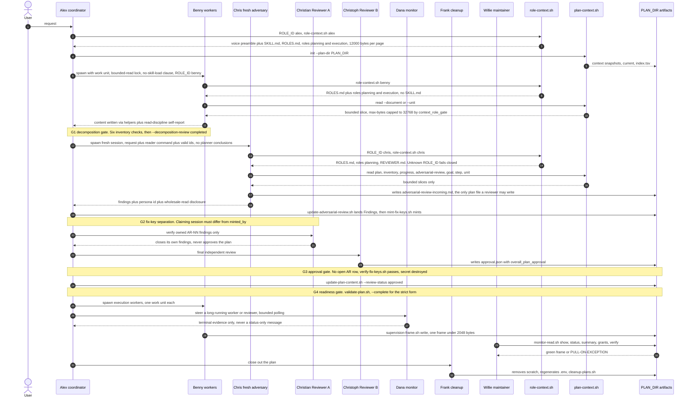
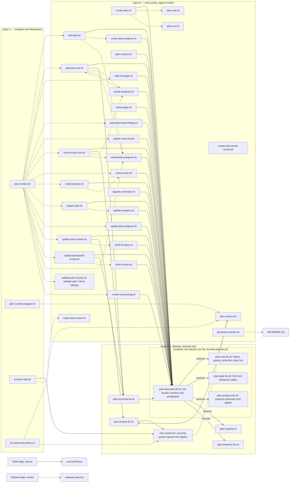
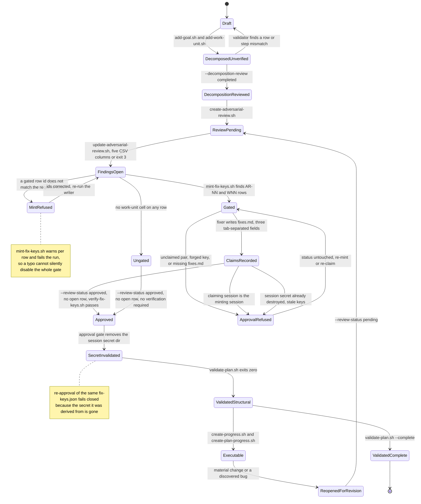
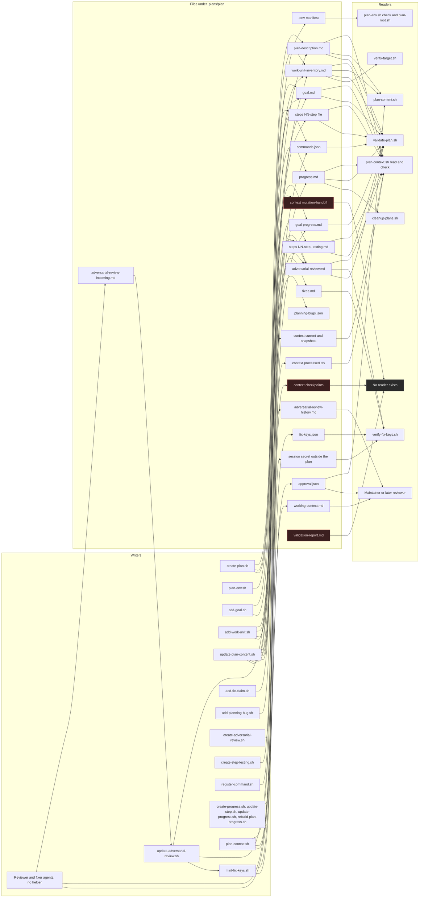

<!-- MODE: DEV -->
# Planning skill — architecture (flows)

**Audience: skill maintainers and developers only.** This file records how the
shipped pieces actually behave: which script writes which artifact, who spawns
whom, what each gate checks, and where the flows contradict the documentation.

It complements the other three internal documents and duplicates none of them:

| Document | Owns |
|---|---|
| `MAINTAINER.md` | Architecture rules and the artifact map — the "must stay true" list |
| `MAINTAINER-STYLE-CONTRACT.md` | Canonical role registry and document-content rules |
| `CODE-STYLE.md` | Shell code rules, including the diagram conventions used here |
| `ARCHITECTURE.md` (this file) | The five cross-script flows, as diagrams |

`SKILL.md` remains the only agent-facing instruction. This file is **not** in
`PACKAGE-MANIFEST.tsv`, not in `PACKAGE-MAP.tsv`, and not in
`install.sh skill_files()` — it is never installed, never copied into a
benchmark capsule, and never loaded by the skill, exactly like `MAINTAINER.md`.

Every diagram below is drawn at the level `CODE-STYLE.md` §11 requires: node
text names a script or an artifact, decision diamonds carry the real condition,
and the reasoning lives in the prose. Line references are `file:line` against
the tree at the time of writing.

---

## 1. Plan lifecycle

```mermaid
flowchart TD
    U["User request"] --> D1{"Durable resumable plan requested?"}
    D1 -->|no| STOP["Do not load the skill"]
    D1 -->|yes| BOUND["Establish plan boundary, writes nothing"]
    BOUND --> D2{"UI, template or user-facing flow in scope?"}
    D2 -->|yes| UIA["create-ui-validation.sh, add-ui-story.sh, configure-ui-story-cache.sh write the plan-description.md UI validation section, ui-user-stories.md, bugs.md, and the ui-story-runs cache"]
    D2 -->|no| ROOT
    UIA --> ROOT
    ROOT["plan-root.sh resolve"] --> D3{"Which root wins?"}
    D3 -->|"PLANS_ROOT exported"| CREATE
    D3 -->|"project .plans consistent with its .env"| CREATE
    D3 -->|"format match under the tsch-ai-skills XDG plans home"| CREATE
    D3 -->|"first plan, prompt or non-interactive default"| CREATE
    CREATE["create-plan.sh writes plan-description.md, work-unit-inventory.md, commands.json"] --> ENV["plan-env.sh write-global and write-plan write the two .env manifests"]
    ENV --> GITINIT["create-plan.sh git init plus initial commit"]
    GITINIT --> REASON["Decomposition reasoning pass, writes nothing"]
    REASON --> GOAL["add-goal.sh writes goal.md, steps dir, plan progress.md"]
    GOAL --> UNIT["add-work-unit.sh writes inventory row, step file, goal section 9.N, goal progress.md"]
    UNIT -->|"one call per work unit"| UNIT
    UNIT --> COV["add-coverage.sh writes coverage rows"]
    COV --> EDIT["update-plan-content.sh writes the named document only"]
    EDIT --> COMP["create-step-testing.sh writes the -testing.md companion"]
    COMP --> REG["register-command.sh writes commands.json"]
    REG --> REACH["verify-target.sh, advisory, writes nothing, fails closed when it cannot check"]
    REACH --> G1{"Six decomposition checks pass?"}
    G1 -->|no| UNIT
    G1 -->|yes| DREV["update-plan-content.sh --decomposition-review completed"]
    DREV --> STUB["create-adversarial-review.sh writes adversarial-review.md pending"]
    STUB --> SPAWN["Alex spawns a fresh adversary, ROLE_ID chris"]
    SPAWN --> INCOMING["Chris writes adversarial-review-incoming.md"]
    INCOMING --> LAND["update-adversarial-review.sh rewrites Findings, archives adversarial-review-history.md"]
    LAND --> MINT["mint-fix-keys.sh writes fix-keys.json and the private session secret"]
    MINT --> D4{"Any AR row still open or in progress?"}
    D4 -->|yes| SWEEP["Seven-surface resolution via update-plan-content.sh and update-work-unit.sh"]
    SWEEP --> CLAIM["Fixer writes fixes.md claim lines"]
    CLAIM --> D8{"Change was material or a bug was found?"}
    D8 -->|yes| SPAWN
    D8 -->|no| LAND
    D4 -->|no| APPROVE["Christoph writes approval.json"]
    APPROVE --> G3["update-plan-content.sh --review-status approved, runs verify-fix-keys.sh, destroys the session secret"]
    G3 --> G4{"validate-plan.sh exits zero?"}
    G4 -->|no| SWEEP
    G4 -->|yes| TRACK["create-progress.sh and create-plan-progress.sh write the trackers"]
    TRACK --> RUN["update-step.sh, update-progress.sh, update-plan-progress.sh write progress rows and bars"]
    RUN --> CTX["plan-context.sh init, read, check write the context cache"]
    CTX --> WCTX["Agent writes working-context.md by hand, no helper exists"]
    WCTX --> D6{"Execution discovered new scope?"}
    D6 -->|yes| UNIT
    D6 -->|no| D7{"All goals completed?"}
    D7 -->|no| RUN
    D7 -->|yes| CLEAN["cleanup-plans.sh calls remove-plan.sh, clears the plans-root history on the last plan"]
    SKILLSRC["SKILL.md REVIEWER_SECTION blocks"] --> GENREV["generate-reviewer.sh"]
    GENREV --> REVDOC["REVIEWER.md, records the source SHA-256"]
```

The three phases that write nothing are the ones agents skip: the boundary
pass, the decomposition reasoning pass (`SKILL.md:424-428` states explicitly
that it creates no files), and `verify-target.sh`, whose output the agent must
transcribe into a discovery unit itself.

Ordering constraints that are enforced in code, not just documented:
`add-work-unit.sh:21` refuses a unit whose goal does not exist yet, so
`add-goal.sh` must precede it; `create-step-testing.sh:149` refuses a companion
without its implementation step; `create-progress.sh:20-23` and
`create-plan-progress.sh:71-74` refuse to overwrite an existing tracker
(exit 73), which is why `plan_rebuild_goal_progress` deletes before recreating.

The `generate-reviewer.sh` pair at the bottom is maintainer-side, not part of a
plan's life: it projects the two allow-listed `REVIEWER_SECTION` blocks out of
`SKILL.md` and fails (exit 65) on a missing, duplicated or empty section
(`generate-reviewer.sh:89-117`).

---

## 2. Role handoff and gates

The registry behind every lane is `role-context.sh:63-75` (`ROLES=()`) with
per-role scope at `:91-104`; `ROLES.md`'s persona matrix is a maintained mirror
of that function, and `roles/VOICES.md` supplies the stance preamble through
`voice_for()` (`role-context.sh:131-140`).

Two gates are identity gates rather than content gates. `role-context.sh:207-234`
refuses any content read without a resolvable `ROLE_ID` and prints
`FAIL-CLOSED identity`, so a worker spawned without a persona cannot read its
own instructions and must be respawned. `plan-context-lib.sh:261-269` decides
per role whether the plan-content gate applies at all: `installer`, `oracle`
and `eve` are refused plan content outright; every other role is capped at
32768 bytes.

The monitor lane is deliberately thin. A subagent ends by writing one bounded
frame (`supervision-frame.sh:70-90`, nine fixed fields, footer-overwriting) and
Willie reads only frames, gated to the maintainer by resolving `ROLE_ID`
through `role-context.sh` in a subshell (`monitor-read.sh:60-73`). Grants
recorded by `supervision-frame.sh grant` carry case and handed command only.

---

## 3. Script layering

`validate-plan.sh` is the one entry point that shares nothing with Layer A: it
carries its own `fail`, `warn`, `trim` and `require_heading`. Its checks are
being moved into `validate-plan-*-lib.sh` siblings, which is why the diagram
names the entry point and its sibling set rather than a single file.

`plan-mutate.sh` is the canonical dispatcher and `exec`s thirteen helpers
(`plan-mutate.sh:79-101`), but two of its subcommands are implemented inline
instead: `add-progress` (`:36-53`) and `rebuild-progress` (`:54-78`), the second
of which is absent from its own usage block (`:8-29` lists only
`rebuild-plan-progress`). Inline logic in a dispatcher is duplicated logic:
`rebuild-progress` re-implements what `create-progress.sh` already does.

Two dependency cycles are drawn as dashed back-edges:

1. **Registry cycle** — `plan-context-lib.sh:276-283` sources `role-context.sh`
   in a subshell to reuse its `resolve_id()`, while `role-context.sh` is itself
   the peer CLI gate an agent runs alongside `plan-context.sh`. The sourcing
   guard at `role-context.sh:163-165` is what stops this from executing the CLI
   main flow; remove the guard and every plan read runs the reader's arg parser.
2. **Progress-rebuild cycle** — `add-work-unit.sh:117` calls
   `plan_rebuild_goal_progress`, which deletes `progress.md` and re-runs
   `create-progress.sh` (`plan-reconcile-lib.sh:131-142`), which re-reads the
   step file `add-work-unit.sh` has just written to derive each row description
   through `plan_step_objective`. The rebuild is destructive by design;
   `remove-work-unit.sh:66` prints the warning that completion statuses must be
   re-applied afterwards.

Sibling resolution is now uniform: every script derives `script_dir` from
`${BASH_SOURCE[0]}` (`update-step.sh` was the last holdout, resolving through
`$(dirname "$0")`, which broke under a symlinked install). `monitor-read.sh`
goes further and resolves the script file's own symlinks with a POSIX
`while [ -L ]` loop — not `readlink -f`, which is GNU-only and arrived on macOS
only in 12.3 — precisely to survive `~/.claude/skills/planning` being a symlink.

Reachable only through `plan-mutate.sh` or a test, and named in no document:
`plan-context-wrapper.sh`, `create-work-unit-inventory.sh`,
`create-ui-story-run-cache.sh`, `add-adversarial-finding.sh`.

---

## 4. Validation and gating state machine

Three of the four gate conditions live in one command. `--review-status
approved` refuses while any `AR-` row is `open` or `in progress`
(`update-plan-content.sh:440`), runs
`verify-fix-keys.sh --claimed-by "${CLAIMED_BY:-<the fix-keys session>}"` when
`fix-keys.json` exists (so an approval that does not name a claiming session
distinct from `minted_by` is refused as self-certification), and then deletes the
session secret directory,
which is what makes a replayed `fix-keys.json` unusable, since
`verify-fix-keys.sh:126` dies on the missing secret. It also requires exactly
one `- Status:` line in each of the two files (`:458-465`), so both statuses
move together or neither does.

The readiness gate has two strengths. Plain `validate-plan.sh` treats an
unapproved review as a WARN and says so (`validate-plan.sh:149`), because it is
expected mid-cycle; `--complete` turns the same condition into a FAIL (`:147`)
and promotes unregistered command literals from WARN to FAIL (`:995`). Only the
`--complete` form is a shipping gate.

Its check groups, in the order they run: plan-description headings and the UI
field; review and description status mirroring; decomposition checkboxes and
the `TBD` ban; anti-hand-edit checks (helper-flag-shaped text, duplicate
paragraph labels, `$script_dir` fragments); the literal placeholder registry;
the `--stale` phrase sweep; work-unit row shape; coverage linkage; dependency
cycles; downstream-proof requirement; the UI story and bug block; goal shape
and size; step-to-inventory identity; the serve check (WARN); the command
registry; and the propagation checks, which are on by default and encode the
seven-surface rule.

---

## 5. Plan directory state files

The three files marked dead are write-only or never-written, and each is a
maintenance trap rather than a feature:

- `context/mutation-handoff` is written by `context_invalidate_after_mutation`
  from `update-plan-content.sh:486-488` on every content mutation. Nothing in
  `planning/scripts/` reads it, so the invalidation it records has no effect.
- `context/checkpoints/<phase>.json` is written only by
  `plan-context.sh checkpoint` (`plan-context.sh:165-184`), which validates its
  phase, state and two SHA-256 hashes carefully. No shipped script consumes the
  result.
- `validation-report.md` is never written by anything, yet `plan-env.sh` writes
  its path into every plan manifest as `PLAN_VALIDATION_FILE`
  (`plan-env.sh:125`) and `check_manifests` requires the key to be present
  (`:137`, `:167`). `validate-plan.sh` reports to stdout only.

Two files are agent-authored with no helper and no validator coverage:
`working-context.md` (`SKILL.md` §2.4) and `fixes.md`. Both are durable state
under `.plans/`, which `SKILL.md` §4.5 says must be written through a helper.

The secret that backs `fix-keys.json` deliberately lives outside the plan, at
`$(planning_tmpdir)/review-fix-keys/<session-id>/secret` with a 700 directory
and a 600 file (`mint-fix-keys.sh:79-96`). Only the derived keys plus
`session_id` and `minted_by` enter the plan.

---

## 6. Known contradictions and dead ends

Recorded as observed. No fixes are proposed here; this document describes the
tree as it is. The numbers are stable ids, so a fixed row is removed and its
number is not reused — rows 5 (the approval gate never passed `--claimed-by`)
and 10 (reachability ran for `markup|style` only) are gone because both were
fixed, not because they were renumbered:

- **Row 5, fixed.** The approval gate now calls
  `verify-fix-keys.sh --claimed-by "${CLAIMED_BY:-<the fix-keys session>}"`, and
  self-certification is counted with the key failures instead of printed as a
  warning after the failure check. An approval that does not name a distinct
  claiming session is refused.
- **Row 10, fixed.** `verify-target.sh` decides what to check from the target
  file rather than the type column: a render-surface file gets checks 1-4 under
  any type, any other file still gets existence and theme-override, and a unit
  with no target — or a render surface with no block name to look for — exits 1
  because the check cannot run. No type exits 0 unchecked, and the `SKIP`
  verdict is gone.

The two benchmark-side risks recorded in `benchmark/planning/runtime/README.md`
(the unbounded analyzer and the `REVIEWER_COMMAND` fall-through) were fixed in
the same change; that file records the new behaviour.

| # | Where | Reality | Consequence |
|---|---|---|---|
| 1 | `plan-document-lib.sh:47-54` vs `SKILL.md:288-292` | `plan_git_snapshot` returns early unless `$plan_dir/.git` exists, but in the default project layout `create-plan.sh:83-89` puts the repo at the plans root. Neither `.plans/reviewer-oracle-evidence-hardening` nor `.plans/gated-review-fix-keys` has a `.git`; `.plans/.git` holds one commit. | The documented recovery path, `git -C <planname> log` after an overwritten paragraph, does not exist for the default layout. No mutation was ever snapshotted for either real plan. |
| 2 | `add-adversarial-finding.sh:30` vs `create-adversarial-review.sh:31` | The insertion anchor is the literal `No additional substantive finding remains.`; the seeded stub says `No finding recorded yet.` Verified live: the script dies with `Review has no finding insertion boundary` on any freshly created review. | `add-adversarial-finding.sh`, and therefore `plan-mutate.sh add-finding`, is unusable. All findings must go through `update-adversarial-review.sh`. |
| 3 | `add-adversarial-finding.sh:14` vs `mint-fix-keys.sh:152`, `verify-fix-keys.sh:108`, `validate-plan.sh:440`, `SKILL.md:352` | The finding writer requires `^AR-[0-9][0-9]+$`, two or more digits; every other consumer uses `^AR-[0-9]+$`. | `AR-1` is mintable and verifiable but cannot be written by the finding helper. Two id grammars for one id. |
| 4 | `add-adversarial-finding.sh:29` | The row template hardcodes `N/A` in the Work-unit column and the script never re-mints. | A finding added this way can never be gated, and the fix-key gate is not refreshed. |
| 6 | `run-adversary-probe.sh:116` vs `SKILL.md:882-887` | The probe's spawn prompt tells the reviewer to write findings and a verdict to `$WORKING/adversarial-review.md` directly. | Contradicts the one-writable-file rule, bypasses `update-adversarial-review.sh`, and so bypasses history archival and key minting. |
| 7 | `plan-context-lib.sh:97-102` vs `SKILL.md:1272-1277` | The gate serves only `plan`, `inventory`, `progress`, `adversarial-review`, `goal:<g>`, `step:<g>/<s>`, `unit:WNN`. `coverage`, `stories`, `fixes`, `fix-keys` and `approval` are `plan-content.sh` ids only. | Reviewers instructed to sweep the coverage table and `ui-user-stories.md` cannot reach them through the gate. `.plans/gated-review-fix-keys/adversarial-review.md` §1.1 records exactly this limitation and a disclosed direct disk read. |
| 8 | `MAINTAINER.md:14-15` | The artifact map lists `PLANNING.md` and `EXECUTION.md` as phase docs. Neither file exists under `planning/`; their content is inside `SKILL.md`. | The authoritative artifact map describes a structure the tree does not have. |
| 9 | `validate-plan.sh:22-38` vs `SKILL.md:1176` | Bare `--stale` consumes the next positional as the phrase file, so `validate-plan.sh --stale <plan-dir>` reads the plan directory as a phrase file and fails `--stale file not found`. `--stale default <plan-dir>` and `--stale=<file>` work. | The stale sweep is order-sensitive in a way the documented form does not signal. |
| 11 | `role-context.sh:145-160` | `can_access` restricts reads to the caller's own role, with the reviewer family mutually readable and the maintainer able to read all. | Documented nowhere in `SKILL.md` or `ROLES.md`. A maintainer changing the persona matrix will not know this cross-role gate exists. |
| 12 | `plan-context-lib.sh:88`, `:139`, `run-adversary-probe.sh:79` | The copy-pasted awk `trim` uses `gsub(/^[[:space:]]+\|[[:space:]]+/, ...)` — the second alternative has no `$` anchor, so internal whitespace is stripped too. `verify-target.sh:97-106` and `add-work-unit.sh:34` use the correct anchored form. | Unit and goal ids containing a space resolve differently depending on which script reads the inventory. |
| 13 | `plan-context-lib.sh` index paths, observed in `.plans/reviewer-oracle-evidence-hardening/context/snapshots/5/index.tsv` | `init` stores whatever `--plan-dir` string it was given; the shipped snapshots hold relative `.plans/...` paths. | `check --all` silently compares nothing useful when run from another working directory. Staleness, not an error. |
| 14 | `.plans/gated-review-fix-keys/adversarial-review.md` and `.plans/reviewer-oracle-evidence-hardening/adversarial-review.md` | The first still has a four-column Findings table with no `Work unit` column; the second has lost its header row entirely, leaving a data row above the separator. | Both mint zero gated pairs, so the fix-key gate is inert on both plans on disk and their approvals passed as ungated. |
| 15 | `plan-mutate.sh:54-78` and `:8-29` | `rebuild-progress` is implemented inline, duplicates `create-progress.sh`, and is absent from the dispatcher's own usage text. | An undocumented subcommand with its own copy of tracker logic to keep in sync. |
| 16 | `update-plan-content.sh` context invalidation | It writes `<plan>/context/mutation-handoff`; no production code reads that file. The only reader is the assertion in `planning/tests/test-plan-context-deferred-boundary.sh`. | A write-only marker until a reader lands. |
| 17 | `plan-mutate.sh` `rebuild-progress` vs `create-progress.sh` | The create path takes `<goal-directory> <goal-name>`, refuses an existing `progress.md` with 73, refuses an empty `steps/` with 66, and prints a "Created" line. `rebuild-progress` must overwrite in place, derive the goal name from the directory, tolerate an empty `steps/` and stay silent. | All four behaviours differ, so dispatching to the create path is not a drop-in; the duplication in row 15 stays until it grows a `--rebuild` mode. |
| 18 | `validate-plan-inventory-lib.sh` `plan_validate_proof_coverage` | The pass acts only on a unit whose goal has `goal_testing_required[<goal>]` set to `yes`, but that map is written by `validate_goal_testing_requirement` in `validate-plan-goals-lib.sh`, which the entry script runs LATER. The map is always empty here and every iteration takes the `continue`. | KNOWN DEAD, deliberately: the "no downstream test or verification work unit" FAIL has never fired. Moving this pass after the goals pass would activate a gate no plan or fixture has been measured against — do that as its own change, with tests. |
