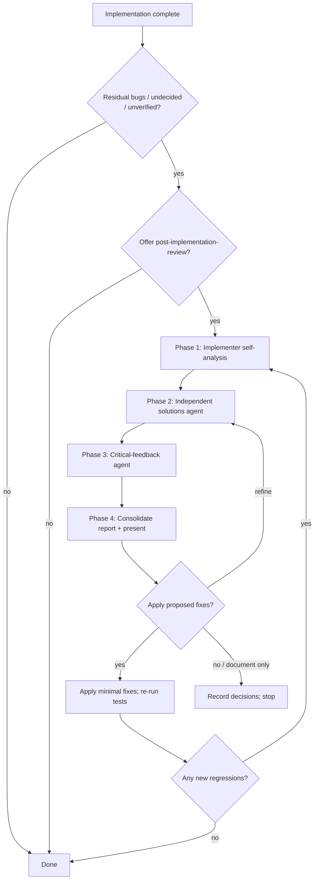

# Post-implementation review

Use this skill to **find and fix what an implementation left behind** — the
bugs, edge cases, and undecided things that only surface once code exists. It
is the formal "review what we just built" step, offered to the user whenever an
implementation concludes with residual risk.

The review runs three roles in order and ends with **concrete, minimal proposed
fixes** and a clear apply-or-decline decision:

1. **Implementer self-analysis** — your own thorough, code-grounded pass.
2. **Independent solutions agent** — a second agent that verifies your findings
   and proposes fixes.
3. **Critical-feedback agent** — a third agent that stress-tests the proposed
   fixes and flags anything over-reaching or overlooked.

## When to offer (entry gate)

Offer this review any time you finish implementing and:
- You know of **potential bugs** or were unsure about correctness.
- The work left **undecided things** (open questions, guessed assumptions,
  "we'll revisit later" choices).
- Behavior was **verified only partially** (e.g., one path proven, others not).
- Changes touched **shared/process-control/launch** code where a subtle break
  is costly.

Ask once, plainly:

> "This implementation left <bugs / undecided choices / unverified paths>. Do
> you want me to run an after-the-fact review and propose fixes?"

Skip (do not ask) when the change is trivial, fully verified, and has no
residual unknowns.

Respect the answer: if the user declines, stop — but record the open items so
they are not lost.

When an implementation is reached via the `brainstorm` skill's "implement as
is" branch, this skill is the expected follow-on if residual issues appear.

## Decision tree



## Phase 1 — Implementer self-analysis

Produce a **findings list grounded in the actual code**, not impressions.

- Re-read the files you changed with fresh eyes: arguments, quoting, `set -e` /
  `pipefail` interactions, PID/process-group handoff, array/quoting, and any
  seam or test path you did not execute.
- Verify each suspected problem against the real source (exact `file:line`).
- Classify every finding:
  - **CONFIRMED** — a real defect with a reproducible trigger;
  - **PARTIAL** — real in a narrow case, or a latent risk, severity low;
  - **NOT-A-BUG** — checked and no issue.
- Check whether anything you left **undecided** (assumed, guessed, or "for
  later") now has a concrete answer you can resolve.
- Keep a strict "test the happy path" mindset: also probe the *unexecuted*
  branches (test seams, fallbacks, alternate agents).
- **Comment discipline.** Apply the comment-discipline contract (planning
  `references/comment-discipline-contract.md`): flag every comment that exceeds
  three lines or lacks a genuinely useful, non-evident programming specific.
  What qualifies as a finding is defined by that contract's clauses 2–4; apply
  clause 6 here (flag as a finding, propose removal or whittling).

## Phase 2 — Independent solutions agent

Hand your findings to a **separate agent with a fresh start and fresh view**
(new context) and ask for **solutions**, with instructions to:

- **Assume the alex persona (evidence-grounded fixer).** Spawn it with
  `ROLE_ID=alex` and have it load its scoped role docs and voice via
  `ROLE_ID=alex bash <PLANNING_SKILL_DIR>/scripts/role-context.sh alex`.
  It traces every proposed fix to a concrete observed defect, never
  best-practice boilerplate; it reports its persona id in its output. A spawn
  that cannot resolve ROLE_ID=alex fails closed and must be respawned.
- **Load no other skill.** Its starting prompt must include verbatim: "Do not
  load any skill on your own. Use only the skills explicitly named in this
  starting prompt; do not infer a skill from file names, directories, or paths
  (for example `.plans/`, `.brainstorm/`, or skill files). If you believe
  another skill is needed, state it and stop — do not load it."
- **Bounded-read locked.** It must read source with scoped/bounded reads (no
  whole-directory dumps), and if it reads any plan/context artifact it must use
  the planning skill's gated reader `plan-context.sh` (bounded views,
  `--max-bytes`, `--max-records`) rather than loading an entire plan file,
  plan directory, or the `.plans/` tree wholesale.
- Verify each of your findings against the code; agree, refine, or mark
  NOT-A-BUG — do not take them on faith.
- Run its **own independent pass** over the same area and report new bugs.
- Propose for each confirmed/partial item a **concrete, minimal fix** with exact
  replacement code, plus the correct location (`file:line`).

Instruct it to be conservative: this is often a stable, tested codebase, so it
must not propose rewrites of core/protocol logic to fix a small bug.

## Phase 3 — Critical-feedback agent

Hand a third agent the findings **and** the proposed fixes, and ask for
**critical feedback**. Its starting prompt must also carry the same skill-lock
clause as Phase 2 ("Do not load any skill on your own…"), so the third agent
reviews from its fresh view without self-loading skills from path clues:

- **Assume the christoph persona (unsparing critic).** Spawn it with
  `ROLE_ID=christoph` and have it load its scoped role docs and voice via
  `ROLE_ID=christoph bash <PLANNING_SKILL_DIR>/scripts/role-context.sh christoph`.
  It points out real weaknesses specifically without courtesy padding; it
  reports its persona id in its output. A spawn that cannot resolve
  ROLE_ID=christoph fails closed and must be respawned.

- Does each proposed fix actually fix the stated bug without breaking anything
  else (regressions, behavior changes, `set -e` traps, process semantics)?
- Is any fix **over-reaching** (changes behavior beyond the bug)?
- Is any fix **under-reaching** (cosmetic, misses the real cause)?
- Are there bugs both prior agents missed?
- Rank: apply as-is / apply-with-changes / reject / document-only.

This third pass is what turns "a fix" into "the right fix" — the independent
third perspective (fresh context, never a reused one) catches the blind spots
of the first two.

## Phase 4 — Consolidate, present, apply

Merge all three into a single review report (see template below) and **write it
to `.plans/<initiative>/post-implementation-review.md`**, beside the
`brainstorm.md` (and any plan) for the same initiative, so the `.plans/`
directory holds the complete set: brainstorm → plan → implementation review.
For each finding the report carries the verdict, proposed fix, critical
assessment, and a recommended action. Present it to the user with a decision:

- **Apply the fixes** (apply the minimal changes, re-run the relevant tests,
  then re-check for regressions).
- **Refine** a fix (loop back to Phase 2/3 on that item).
- **Document only / reject** (record why a fix was declined, keep the note).

If fixes are applied and a new regression appears, restart the loop at Phase 1
(do not silently paper over the regression).

## Operating rules

- **Ground every finding in code** with `file:line`. No vibes.
- **Prefer minimal fixes** that restore correct behavior; avoid scope creep.
- **Do not rewrite core/protocol/oracle logic** to fix a bug unless the bug is
  in that logic and the fix is surgical.
- **Be honest about severity.** Not every finding needs a fix; flag
  document-only items.
- **Respect the user's call.** The user can decline a fix; that is final.
- **Comment hygiene is a review finding.** Apply the comment-discipline
  contract (`planning/references/comment-discipline-contract.md`): comments in
  produced code MUST be ≤3 lines and keep only genuinely useful, non-evident
  programming specifics; oversized or empty comments are a finding with a
  proposed removal/whittling fix, in every phase (self-analysis, independent
  solutions, critical feedback).
- **Skill-locked subagents.** Every subagent you spawn (solutions agent,
  critical-feedback agent) must be instructed in its starting prompt to load no
  skill other than the one(s) explicitly given, using the "Do not load any
  skill on your own…" clause verbatim, so no subagent self-loads `planning` or
  other skills from `.plans/` or file-name clues.
- **Do not over-offer.** Only propose the review when there is real residual
  risk (the entry gate). Repeatedly offering after the user has declined is
  noise.

## Review report template

```markdown
# Post-implementation review: <initiative>

## Scope
<What was implemented and reviewed; commit/range.>

## Findings (Phase 1 — implementer analysis)
| ID | Verdict | file:line | Problem | Trigger/repro |
|----|---------|-----------|---------|---------------|
| F1 | CONFIRMED | path:line | <problem> | <how to reproduce> |

## Proposed fixes (Phase 2 — independent solutions)
| ID | Proposed fix | Exact change | Risk |
|----|--------------|--------------|------|
| F1 | <fix> | <replacement code or diff> | <low/med/high> |

## Critical feedback (Phase 3 — third agent)
| ID | Assessment | Apply as-is? | Notes |
|----|------------|--------------|-------|
| F1 | <does it fix it? regressions? over/under-reach?> | yes/with-changes/no | <notes> |

## Independent findings from Phase 2/3
<New bugs the solution/critical agents found that the implementer missed.>

## Decision
<Apply F1… / refine / document-only + why; record any declined fixes.>

## Verification
<Tests/lint run after applying fixes; results.>
```

## Handoff

The report at `.plans/<initiative>/post-implementation-review.md` is the durable
record and completes the `.plans/<initiative>/` set alongside the brainstorm
document and any plan. Its **Decision** section keeps applied fixes and
recorded-but-declined items visible so neither is silently lost. The `brainstorm`
skill (which records undecided things up front) and this skill are complementary
bookends around planning and implementation.
